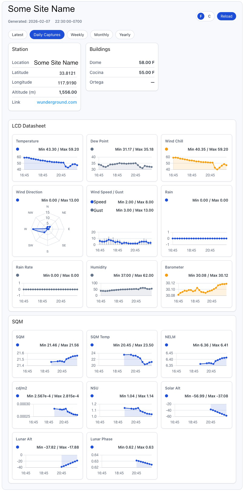

# WPWeeWX

Display WeeWX JSON weather data with a shortcode.

## Changelog

See `CHANGELOG.md` for release history.

## Plugin Info

- Contributors: Joey Troy, gpt-5.2-codex
- Requires at least: 6.0
- Tested up to: 6.6
- Requires PHP: 8.0
- Stable tag: 0.2.0
- License: GPLv3
- License URI: https://www.gnu.org/licenses/gpl-3.0.html
- Plugin Website: https://github.com/open-astro/WPWeeWX

## Description

WPWeeWX fetches WeeWX-generated JSON and renders responsive weather dashboards.

## Installation

1. Upload the plugin folder to `/wp-content/plugins/`.
2. Activate the plugin in WordPress.
3. Install the WeeWX JSON generator (weewx-json) from https://github.com/teeks99/weewx-json/releases.
4. Configure JSON URLs under Settings → WeeWX Weather.

## Usage

Use `[weewx_weather]` or specify attributes:

`[weewx_weather source="simple" view="current"]`

## Timezone

LCD timestamps are rendered using the WordPress site timezone (Settings → General → Timezone).
